<h1 align="center"><a href="https://julenetxaniz.eus/en/" target="blank">Julen Etxaniz</a></h1>

<h2 align="center">PhD Student in Language Analysis and Processing at Hitz Zentroa UPV/EHU  Working on Improving Language Models for Low-resource Languages.</h2>

<h2 align="center">GitHub Stats</h2>

<h2 align="center">GitHub Trophies</h2>

<h2 align="center">Top Languages</h2>

<!--h2 align="center">Weekly Top Languages</h2>
<p-- align="center"></p-->
